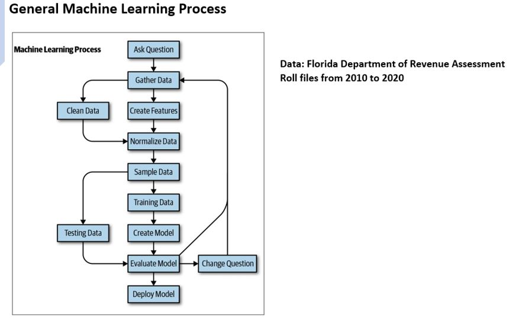
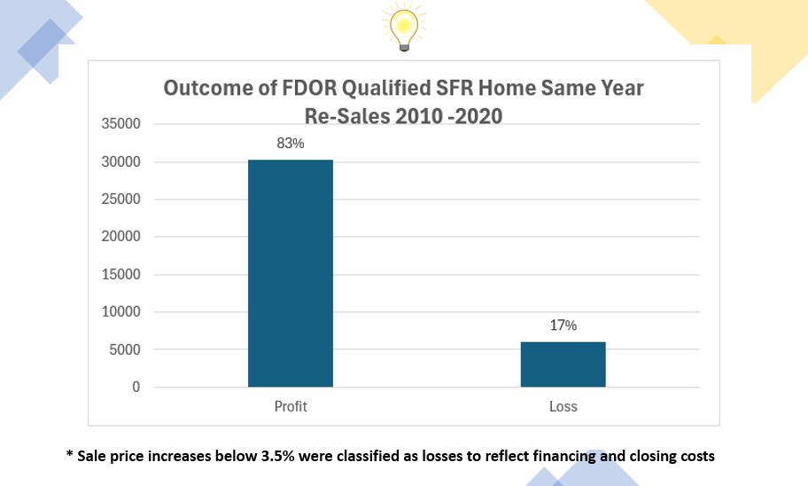
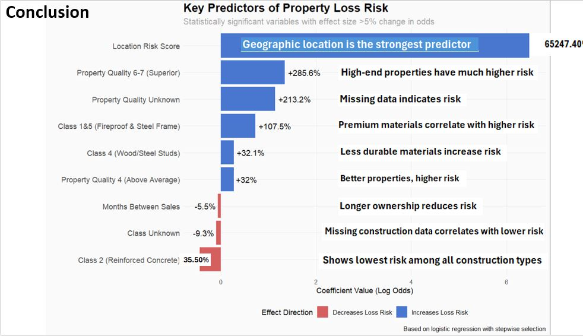

# FDOR Real Estate Investment Analysis

A machine learning project analyzing 10 years of Florida Department of Revenue tax roll data to predict profitability of single-family home resales.

## Project Overview

This project processes 634 GB of Florida property assessment data to build predictive models that forecast whether a single-family home will generate a profit or loss when resold within the same calendar year. The analysis focuses on identifying key factors that drive investment outcomes in the Florida real estate market.

## Business Problem

Real estate investors and iBuyer companies need to quickly assess whether a property purchase will be profitable. This project aims to:
- Identify the strongest predictors of property resale profitability
- Build models that can flag high-risk investments
- Provide data-driven insights for investment strategy optimization

## Data Source

**Florida Department of Revenue (FDOR) Assessment Tax Rolls**
- **Time Period:** 10 years of historical data
- **Size:** 634 GB across 700+ files
- **Scope:** All 67 Florida counties
- **Records:** 10+ million property parcels

## Technical Approach

### 1. Data Engineering
- **Challenge:** 700 separate files requiring consolidation
- **Solution:** 
  - Command-line automation scripts for file extraction and processing
  - Custom SQL Server database build to bypass import limitations
  - Structured schema design for efficient querying

### 2. Exploratory Data Analysis
**Tools:** SQL Server

Key analyses performed:
- Parcel counts and geographic distribution
- Identification of institutional buyers (iBuyers like OpenDoor, Offerpad)
- Transaction volume and timing patterns
- Price trends by region and property type

### 3. Machine Learning Models
**Tools:** R, caret package, randomForest

**Models Built:**
1. **Logistic Regression** - Baseline binary classifier
2. **Random Forest** - Advanced ensemble method

**Key Techniques:**
- Stratified sampling to maintain class distribution
- SMOTE (Synthetic Minority Over-sampling Technique) to address class imbalance
- Cross-validation for model evaluation
- Feature importance analysis

**Model Performance:**
- Random Forest achieved high recall for loss identification
- Successfully flags high-risk properties for further review

## Key Findings

### Primary Insight
**Geographic location is the single strongest predictor of profitability.** The calculated "subdivision risk score" outperformed all property-specific features.

### Secondary Insights
- Property characteristics (size, age, condition) have limited predictive power
- Market timing within a calendar year shows minimal impact
- The profit/loss prediction problem is inherently difficult, even with extensive historical data
- iBuyer activity patterns are identifiable in the data

## Technologies Used

- **Database:** SQL Server
- **Programming:** R
- **Key R Packages:** 
  - `caret` - Model training and evaluation
  - `randomForest` - Random Forest algorithm
  - `DMwR` - SMOTE implementation
  - `dplyr` - Data manipulation
- **Scripting:** Bash (command-line automation)

## Business Applications

This analysis framework can support:
- **Investment Risk Assessment** - Flag high-risk properties before purchase
- **Portfolio Optimization** - Focus acquisitions on high-probability-profit areas
- **Market Intelligence** - Track competitor (iBuyer) activity patterns
- **Strategic Planning** - Identify geographic markets with best risk/reward profiles

## Future Enhancements

- **Power BI Dashboard** - Interactive visualization of risk scores and predictions
- **Python Migration** - Rebuild models using scikit-learn for broader deployment
- **Real-time Scoring API** - Deploy model as web service for instant predictions
- **Expanded Features** - Incorporate economic indicators, crime data, school ratings
- **Time Series Analysis** - Add forecasting for property value appreciation

## Video Presentation

For a detailed walkthrough of the project methodology and findings:
[Watch Project Presentation](https://youtu.be/q313-EOkkJs)

## Results & Impact

**Technical Achievement:**
- Successfully processed and modeled 634 GB of complex government data
- Built production-ready database from raw files
- Demonstrated advanced techniques for handling imbalanced datasets

**Analytical Achievement:**
- Identified geographic location as primary profitability driver
- Created actionable risk scoring system
- Proved concept viability despite problem difficulty

**Transferable Skills:**
- Government data expertise
- End-to-end analytics workflow (data engineering → modeling → insights)
- SQL database design and optimization
- Statistical modeling and machine learning
- Business problem translation to technical solution

## Author

**Rus** 
- GitHub: [@RusUsf](https://github.com/RusUsf)
- Project Repository: [FDOR_Data_and_Models](https://github.com/RusUsf/FDOR_Data_and_Models)

## Acknowledgments

- Florida Department of Revenue for public data access
- Real estate domain experts who provided business context

---

